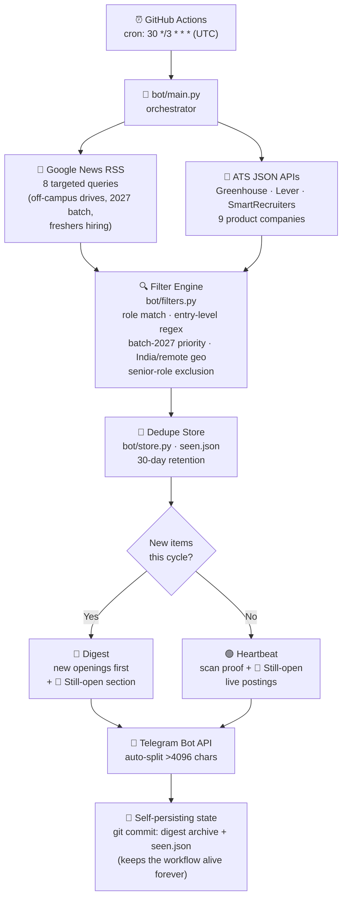

<div align="center">

# 🎯 Placement Digest Bot

**An autonomous head-hunter that watches the Indian tech job market every 3 hours — so you never miss an opening for your batch.**

[](https://github.com/Gurunanda-2006/telegram-bot/actions/workflows/digest.yml)


</div>

---

## 💡 The Pitch

If you're a **2027-batch** student hunting for software internships or full-time roles in India, you know the pain:

- Off-campus drives are announced **randomly** — LinkedIn posts, news articles, career pages
- By the time you hear about a drive, registrations are half-closed
- Checking Amazon, Flipkart, Google, startup boards **manually, every day** doesn't scale
- Job portals bury fresh-grad roles under 5-year-experience listings

**Placement Digest Bot solves this by becoming your 24/7 scraping intern.** Every 3 hours, it wakes up on a GitHub Actions runner, sweeps news wires and live company job boards, filters everything through a role/eligibility/location engine, and drops a clean digest straight into your Telegram — with **direct apply links**. Zero servers. Zero cost. Fully transparent — every scan is committed to this repo.

---

## ⚙️ How It Works



### The pipeline in plain words

| Stage | What happens | Where |
|---|---|---|
| **⏰ Trigger** | GitHub Actions fires on schedule (`30 */3 * * *`) or manual `workflow_dispatch` — no server needed | `.github/workflows/digest.yml` |
| **📰 News sweep** | Queries Google News RSS for off-campus drives, 2027-batch announcements, fresher hiring — items older than **7 days are discarded** | `bot/sources/news_rss.py` |
| **🏢 ATS sweep** | Polls public JSON boards of 9 companies (PhonePe, CRED, Meesho, Groww, Postman, Paytm...) for live postings | `bot/sources/ats.py` |
| **🔍 Filtering** | Regex + keyword engine: keeps SDE/SWE/frontend/full-stack/automation roles, detects junior signals (`intern`, `SDE-1`, `0-2 years`), **drops** managers/senior/staff titles, enforces **India-onsite-or-remote** | `bot/filters.py` |
| **🧠 Dedupe** | SHA-1 fingerprints of URLs stored in `seen.json` (30-day retention) — you never see the same opening twice | `bot/store.py` |
| **🎯 Ranking** | Items mentioning **2027** rank first → live ATS postings → other fresher/off-campus news | `bot/filters.py :: sort_key` |
| **📲 Delivery** | Telegram messages with 🏢/📰/🎓 badges and **direct apply URLs**; news items get the company's official careers page as fallback | `bot/digest.py`, `bot/telegram.py` |
| **💾 Persistence** | Every run commits its digest archive + updated state back to the repo — full public history, and the 60-day workflow auto-disable never triggers | workflow commit step |

---

## 📲 What lands in your Telegram

```
🎯 Placement Digest — 2026-08-24 09:30 UTC
6 new for 2027 batch

🏢🎓 PhonePe — Software Engineer Intern
📍 Bangalore · Internship
🔗 Apply: https://job-boards.greenhouse.io/phonepe/jobs/...

📰 Amazon — Off Campus Drive 2027 Batch | Software Engineer
📰 Details: https://news.google.com/...
✅ Apply via careers page: https://www.amazon.jobs/en/

📌 Still open — live postings from earlier scans:
🏢 CRED — web developer
🔗 https://jobs.lever.co/cred/...
```

**Badges:** 🏢 live ATS posting · 📰 news/drive announcement · 🎓 entry-level signal detected

When nothing new is found, the bot still reports in:

```
🟢 No new openings in the last 3 hours — 2026-08-24 12:30 UTC
Scanned 321 listings · next check in 3 hours.
📌 Still open — live postings from earlier scans: ...
```

Every scan is archived under [`digests/`](digests/) — one markdown file per run, forever browsable.

---

## 🗂️ Project Structure

```
telegram-bot/
├── .github/workflows/digest.yml   # the entire "server": cron + run + auto-commit
├── bot/
│   ├── main.py                    # orchestrator: fetch → filter → dedupe → send → persist
│   ├── filters.py                 # role / entry-level / batch / geo / seniority engine
│   ├── store.py                   # seen.json state (atomic writes, 30-day pruning)
│   ├── digest.py                  # message formatting + markdown archive
│   ├── telegram.py                # Bot API client with message auto-splitting
│   └── sources/
│       ├── news_rss.py            # Google News RSS + 7-day freshness window
│       └── ats.py                 # Greenhouse / Lever / SmartRecruiters adapters
├── config/
│   ├── companies.yaml             # tracked companies, ATS slugs, careers URLs, queries
│   └── keywords.yaml              # roles, junior patterns, exclusions, geo, settings
├── digests/                       # 📚 auto-committed archive (one .md per run)
└── seen.json                      # 🧠 dedupe state (auto-committed)
```

---

## 🚀 Run Your Own

<details>
<summary><b>1. Create the Telegram bot (2 min)</b></summary>

1. Message [@BotFather](https://t.me/BotFather) → `/newbot` → copy the **token**
2. Send any message to your bot, then open `https://api.telegram.org/bot<TOKEN>/getUpdates` → grab `"chat":{"id": <number>}`
3. For a channel/group: add the bot as admin, post once, use the `-100...` group id

</details>

<details>
<summary><b>2. Fork / clone & add secrets</b></summary>

Fork this repo (or clone and push to a new one), then:

**Settings → Secrets and variables → Actions → New repository secret**

| Secret | Value |
|---|---|
| `TELEGRAM_BOT_TOKEN` | from BotFather |
| `TELEGRAM_CHAT_ID` | from getUpdates |

</details>

<details>
<summary><b>3. First run & schedule</b></summary>

- **Manual:** Actions tab → *placement-digest* → **Run workflow**
- **Automatic:** cron fires every 3 h at `:30` (00:30, 03:30 … UTC) = **6 AM, 9 AM, 12 PM, 3 PM, 6 PM, 9 PM IST**

> ⚠️ GitHub Actions cron can fire a few minutes late under load — normal and harmless.

</details>

<details>
<summary><b>Local dry-run (Windows)</b></summary>

```powershell
python -m pip install -r requirements.txt
$env:DRY_RUN = "1"
python bot/main.py
```

No secrets needed — the digest prints to console and `seen.json` is left untouched.

</details>

---

## 🔧 Customization — no code required

| File | Change |
|---|---|
| `config/companies.yaml` | Add a company with an `ats:` platform + `board:` slug → it gets polled live. Add a `careers:` URL → news items link to it. Find slugs in careers-page URLs (`greenhouse.io/<slug>`, `lever.co/<slug>`, `jobs.smartrecruiters.com/<slug>`) |
| `config/companies.yaml → news.queries` | Any Google News search string becomes a monitored feed |
| `config/keywords.yaml` | Roles, junior-detection regex (`level_patterns`), seniority exclusions, batch years, India cities, `max_items_per_digest`, `still_open_max` |

---

## 🧭 Design Decisions & Honest Caveats

- **Why news RSS + ATS APIs (hybrid)?** Batch eligibility ("2027 batch") appears in *drive announcements*, while *live postings* live in ATS systems — neither source alone covers both.
- **Why not Amazon/Google/Flipkart live boards?** They sit behind Workday/custom systems with no public JSON API. They're still covered via news announcements, and each company's careers URL is one tap away in every digest.
- **Why git as the database?** Actions runners are ephemeral. Committing `seen.json` back gives free durable state, a public audit trail, and resets GitHub's 60-day scheduled-workflow auto-disable on every run.
- **Dedupe is intentional.** An opening you've already seen won't re-appear as "new" — but the **📌 Still open** section keeps genuinely live roles visible every cycle.

---

## 🗺️ Roadmap

- [x] Hybrid sourcing (news + ATS), dedupe, Telegram delivery
- [x] Heartbeat + still-open section (every run is useful)
- [x] Apply links + careers-page fallbacks
- [ ] **Phase 2 — resume-aware scoring:** a `profile.yaml` (skills, preferred roles/cities) scores every posting → 🔥 strong match / 👍 relevant / 📄 FYI tags
- [ ] Unstop / hiring-challenge aggregator coverage
- [ ] Per-company mute/unmute from Telegram commands

---

<div align="center">

**⭐ If this helped you catch an opening, star the repo — it helps other 2027 grads find it.**

Built with Python, feedparser, and an unhealthy obsession with not missing deadlines.

</div>
